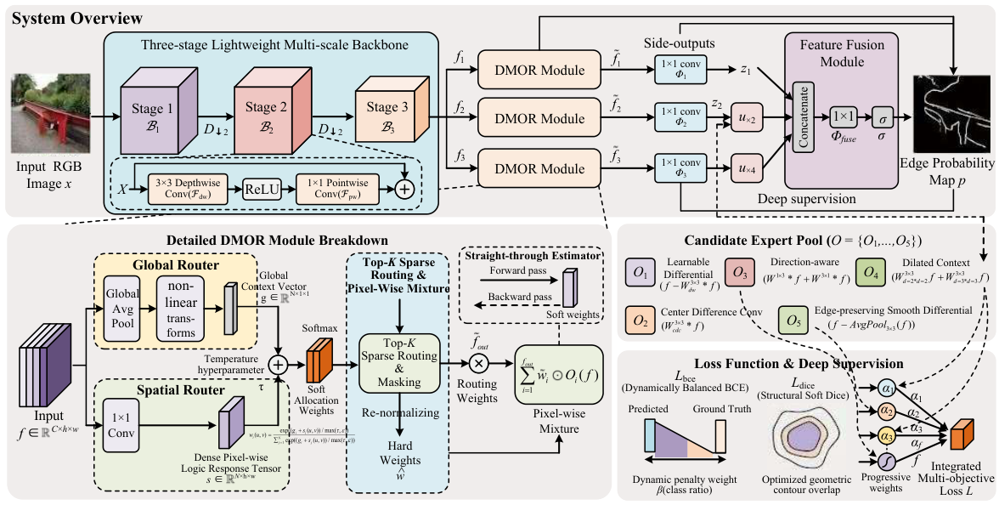

# DMOR-Net: Dynamic Multi-Operator Routing for Lightweight Edge Detection

<!-- <p align="center"><b>Conference Year</b></p> -->

<p align="center">
  <a href="LICENSE"></a>
  
  
</p>

<!-- [[Paper]]() | [[Project Page]]() -->

<p align="center">

</p>

## Highlights

- **Dynamic operator routing** in operator space with dual-level (global + spatial) gating
- **Top-K sparse routing** with straight-through estimation, enabling zero-shot subnetwork pruning
- **Only 0.13M parameters** with competitive ODS/OIS/AP on BSDS500, BIPEDv1, and NYUDv2

## Main Results

Evaluation of DMOR-Net across BSDS500, BIPEDv1, and NYUDv2 benchmarks.

| Dataset | Input | ODS | OIS | AP | Params (M) | FLOPs (G) | FPS |
|:--------|:-----:|:---:|:---:|:--:|:----------:|:---------:|:---:|
| BSDS500 | RGB | 0.837 | 0.843 | 0.903 | 0.134 | 4.36 | 52.6 |
| BIPEDv1 | RGB | 0.968 | 0.971 | 0.982 | 0.134 | 4.36 | 22.4 |
| NYUD | RGB | 0.859 | 0.859 | 0.873 | 0.132 | 5.10 | 38.6 |
| NYUD | HHA | 0.858 | 0.853 | 0.764 | 0.132 | 5.10 | 38.6 |
| NYUD | RGB-HHA | 0.860 | 0.859 | 0.874 | 0.132 | 5.10 | 38.6 |

> Please refer to our paper for full comparison with state-of-the-art methods.

## Installation

```bash
conda create -n dmor python=3.8 -y
conda activate dmor
pip install torch torchvision --index-url https://download.pytorch.org/whl/cu118
pip install opencv-python scipy numpy thop tqdm scikit-learn
```

## Data Preparation

Download the datasets from their official sources and organize as follows:

```
dataset/
├── BSDS500/data/
│   ├── images/{train,val,test}/
│   └── groundTruth/{train,val,test}/
├── BIPEDv2/
│   ├── imgs/
│   └── edge_maps/
└── NYUDv2/
    ├── images/
    ├── gt/
    └── HHA/
```

| Dataset | Source |
|:--------|:-------|
| BSDS500 | [Berkeley website](https://www2.eecs.berkeley.edu/Research/Projects/CS/vision/grouping/resources.html) |
| BIPEDv2 | [GitHub](https://github.com/xavysp/BIPED) |
| NYUDv2 | [NYU website](https://cs.nyu.edu/~silberman/datasets/nyu_depth_v2.html) |

## Pretrained Models

Our best model checkpoint is provided in `result/`.

| Model | Dataset | ODS | OIS | AP | Download |
|:------|:--------|:---:|:---:|:--:|:--------:|
| DMOR-Net (K=2, C=32) | BSDS500 | 0.837 | 0.843 | 0.903 | [result/](result/) |

## Quick Start

### Testing with Pretrained Weights

```bash
python scripts/bsds_export.py \
    --data_root dataset/BSDS500/data \
    --ckpt result/dmor_best.pth \
    --out_dir outputs/test_png \
    --device cuda
```

### Evaluation

```bash
python pipelines/eval_bsds500.py \
    --pred_dir outputs/test_png \
    --gt_dir dataset/BSDS500/data/groundTruth/test
```

## Training

### BSDS500

```bash
python scripts/bsds_train.py \
    --data_root dataset/BSDS500/data \
    --out_dir outputs/bsds \
    --ckpt_dir outputs/ckpt \
    --epochs 200 --batch 4 --img_size 512 \
    --router_mode dmor --topk 2 --amp
```

### BIPEDv2 / NYUDv2

```bash
python scripts/biped_nyud_train.py \
    --dataset BIPED \
    --data_root dataset/BIPEDv2 \
    --ckpt_dir outputs/ckpt_biped \
    --epochs 40 --amp
```

<details>
<summary><b>Full argument list</b></summary>

| Argument | Default | Description |
|:---------|:--------|:------------|
| `--router_mode` | `dmor` | `dmor` / `global` / `spatial` / `uniform` |
| `--topk` | `2` | Active operators per location (0 = dense) |
| `--channels` | `32` | Base feature channels |
| `--temperature` | `1.0` | Softmax temperature |
| `--amp` | — | Mixed precision training |

</details>

## Repository Structure

```
DMOR-Edge/
├── models/
│   ├── dmor.py          # DMOR routing module
│   ├── net.py           # DMOREdgeNet (backbone + decoder)
│   ├── operators.py     # Operator pool (O1–O5)
│   └── loss.py          # Balanced BCE + Dice loss
├── scripts/             # Training, export, profiling
├── pipelines/           # Evaluation (BSDS500, BIPED, NYUDv2)
├── test/                # Ablation experiments
├── result/              # Pretrained checkpoint
└── fig/                 # Figures
```


## Acknowledgement

We thank the authors of [BSDS500](https://www2.eecs.berkeley.edu/Research/Projects/CS/vision/grouping/resources.html), [BIPED](https://github.com/xavysp/BIPED), and [NYUDv2](https://cs.nyu.edu/~silberman/datasets/nyu_depth_v2.html) for releasing their datasets.

## License

This project is released under the [MIT License](LICENSE).
